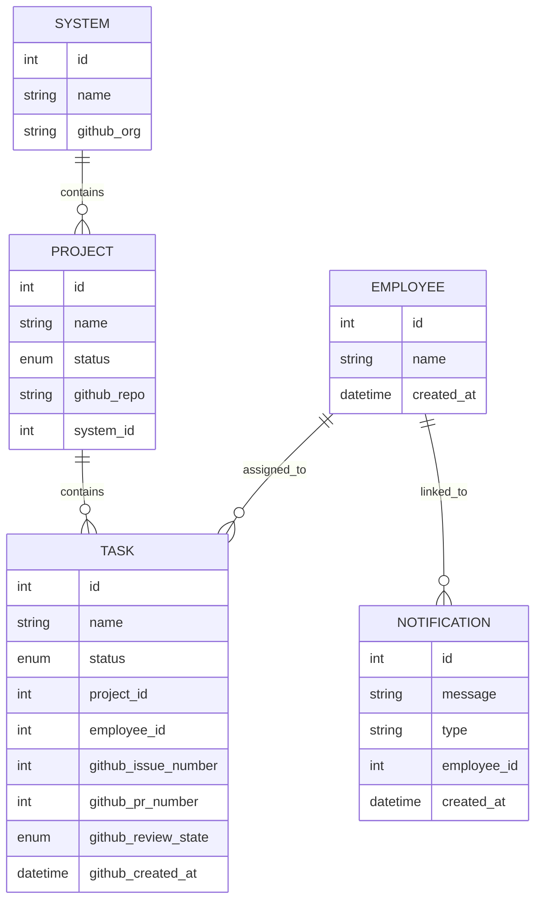

# Business Logic — Domain Model & Rules

Schema for `dashboard_app/app/models.py`, using SQLAlchemy as the ORM over a single SQLite
database (WAL mode, for concurrent access by the Flask process and the `github-sync` worker).
See [ADR 0001](../adr/0001-system-project-task-hierarchy.md) for why this hierarchy replaced the
earlier Project→Process→Task one.

## Entity-Relationship Diagram

## Entities

- **Employee**: represents system and human agents. No status field.
- **System**: a GitHub organization (e.g. "Acme") that owns one or more Projects. `github_org`
  is nullable — a System can exist without a linked org. `Project.system_id` is auto-derived from
  the owner portion of `github_repo` on create/update unless explicitly set (see
  `execution/agent_actions.py::_resolve_system_id`).
- **Project**: a GitHub repository — the mid-level container for work. `github_repo` and
  `system_id` are both nullable (a manually-created Project needn't be GitHub-linked). Deleting a
  System cascades to its Projects; deleting a Project cascades to its Tasks.
- **Task**: the atomic unit of work, assigned to at most one Employee, belonging to exactly one
  Project. `github_issue_number`/`github_pr_number` are nullable and populated by `github_sync`.
  `github_review_state` is likewise nullable, populated only by the fast/active-task cadence (see
  "Auto-status rules" below), and driven by `ReviewStateEnum` (`Changes Requested`,
  `Changes Applied`).
- **Notification**: a persisted record of every toast the dashboard has ever shown — the Dashboard's
  "Notification History" panel reads from this table. `type` mirrors the toast type (`success`/
  `error`/`info`). `employee_id` is nullable and only ever set for Task-related events (the Task's
  assignee at the time) — System/Project/Employee-entity notifications carry no employee, since
  those entities have no assignee concept. Populated from *both* toast-dispatch mechanisms — see
  `domains/flows.md`'s toast-mechanism section. No retention/cleanup policy (same accepted gap as
  `ChatMessage`); the Dashboard query caps display at the 200 most recent rows.

## Computed properties (not columns — `models.py`)

- `Project.progress` — `%` of the Project's Tasks with `status == Done`, 0 if it has none.
- `Project.is_complete` — `True` iff the Project has at least one Task and every Task is `Done`;
  drives the completed-row strikethrough styling in the Projects and System-detail tables.
- `Task.github_url` — the task-name link target: the linked PR's URL if `github_pr_number` is set,
  else the linked issue's URL if `github_issue_number` is set, else `None`. PR takes priority over
  issue when both exist.
- `Task.github_issue_url` / `Task.github_pr_url` — the same two links individually, used by the
  Tasks table's separate Issue/PR columns.
- `Task.review_state_class` — maps `github_review_state` to a CSS class name
  (`task-title-changes-requested` / `task-title-changes-applied` / `None`) for the Tasks table's
  title-color styling. Exists specifically so the template never interpolates the enum's raw,
  space-containing value into a `class="..."` attribute (which would silently produce two broken
  class tokens, the same latent trap `StatusEnum`'s `"Repeat Daily"`-style values have for badges).

## `StatusEnum`

`Todo`, `In-Progress`, `Testing`, `Done`, `Blocked`, `Repeat Daily`, `Repeat Weekly`,
`Repeat Monthly`. Shared across Project and Task, except the three `Repeat_*` values, which are
reserved for Tasks only and filtered out of Project status dropdowns —
`execution/repetition_processor.py` resets a repeating Task back to `Todo` on the appropriate
cadence (daily; weekly on Monday; monthly on the 1st), each time its `updated_at` predates the
reset boundary. **That boundary is the local calendar day in `DISPLAY_TIMEZONE`** — local
midnight / local Monday / the local 1st — not UTC midnight (see
`adr/0002-store-utc-display-local.md`). Both sides of the comparison are converted:
`updated_at` is stored naive UTC, so converting only "today" would swap one off-by-one for
another (a Task updated `2026-09-09 02:00Z` has UTC date 09-09 but Caracas date 09-08).
`DISPLAY_TIMEZONE` defaults to `UTC`, which makes the whole conversion an identity — so the
default configuration behaves exactly as it did before this was introduced. Nothing schedules
this processor automatically: the only callers are `flask process-repetitions`, the module's
own `__main__`, and the tests, so a correct *boundary* is not the same as a timely reset.

## Auto-status rules (`execution/github_sync.py`)

This is the business logic governing how a Task's status gets computed from live GitHub state —
see that module's own docstring for the authoritative, always-current version; summarized here:

- A **still-open issue** updates Todo/Testing/Done Tasks freely. An **In-Progress** Task only ever
  advances forward (to Testing once a PR is linked, to Done once it's merged) — never regressed
  back to Todo, since a human already claimed it. A **Blocked** Task is left alone by this weaker
  signal.
- A **closed issue** is the highest-priority signal and overrides *any* current status, including
  a manually-set Blocked: closed issue + a closed/merged PR → `Done`; closed issue with no
  completed PR → `Blocked`.
- Same top priority even while the issue is still **open**: if its only related PR(s) were closed
  without merging (abandoned), that's `Blocked` too. GitHub drops a closed-unmerged PR from the
  `closedByPullRequestsReferences` connection, so this specific case is detected via a separate
  `timelineItems` (`CROSS_REFERENCED_EVENT`) query instead — see `_abandoned_pr_refs`.
- Any `Repeat_*` status is always left untouched by sync.
- **Sync scope — a `Blocked` Project is skipped entirely, by both cadences.** `sync_once` and
  `sync_active_tasks_once` both filter `Project.status != StatusEnum.BLOCKED` (and
  `github_repo IS NOT NULL`), so while a Project is Blocked none of its Tasks are reconciled *and*
  none of its new issues are discovered — the rules above simply do not run for it, silently, with
  nothing logged to distinguish "nothing changed" from "not looked at." Its rows keep whatever
  status/assignee they last had and issues opened since it was blocked have no Task at all. This
  is the one case where a local, hand-set status or assignee on a GitHub-linked Task is durable.
- Employee assignment is always overwritten to mirror GitHub's current single-assignee resolution
  (0 or 2+ assignees → unassigned).

### Review-state rule (`github_review_state`, active-task cadence only)

Unlike the status rules above (which run on both the 60s discovery pass and the 5s active-task
pass), this sub-rule runs **only** on `sync_active_tasks_once` — a Todo Task with a PR under
review is intentionally never colored; it only starts getting checked once it's In-Progress or
Testing. This is why `fetch_issues_by_number`'s query is parameterized by `fields`: the active-task
pass asks for `ISSUE_FIELDS_WITH_REVIEW` (adds `reviews`/`commits` under each PR ref), while the
discovery pass keeps the original, cheaper `ISSUE_FIELDS`.

- Reviews are deduped to each author's **latest** submission first — GitHub never mutates an
  earlier review's `state` when the same author submits a later one, so without this a reviewer
  who requested changes and later approved would still read as "outstanding."
- If any author's latest review is `CHANGES_REQUESTED`, `github_review_state` is set to
  `CHANGES_REQUESTED` — unless the PR's latest commit landed *after* that review's `submittedAt`,
  in which case it's `CHANGES_APPLIED` instead (`_compute_review_state`).
- With no outstanding `CHANGES_REQUESTED` review, it's cleared to `NULL`.
- It's unconditionally cleared to `NULL` the moment a Task's computed status becomes `Done` or
  `Blocked` — necessary because `sync_active_tasks_once` never revisits a Task once it leaves
  In-Progress/Testing, so this is the only chance to clear it via sync.
- A **manual** status change via the Tasks-table dropdown (`update_task_status` in
  `dashboard_app/app/main/routes.py`, which writes `Task.status` directly and bypasses
  `agent_actions.update_task`) also clears `github_review_state` when the new status isn't
  In-Progress/Testing — otherwise a human-driven status change would orphan a stale title color
  that sync would never revisit either.
- "Merged" here matches the existing merge-detection behavior exactly (any merged linked PR, via
  `state == MERGED`) — there is no base-branch-specific ("must be `main`") check, consistent with
  how `_compute_status` has never had one.

## Task list ordering and visibility

- `sort_tasks()` (`dashboard_app/app/main/routes.py`) is the **single ordering authority** for
  every Tasks-view rendering path — none of the three queries carries an `order_by`. It sorts on
  two levels, as two stable passes (one key cannot mix an ascending field with a descending one
  without negating a datetime):
  1. **status bucket**: **Testing → In-Progress → Todo → Repeat_\* → Done → Blocked**
  2. **within a bucket**: newest GitHub issue first, by `Task.github_created_at` descending.
- `github_created_at` holds **GitHub's own `issue.createdAt`**, naive UTC, and is *not*
  interchangeable with the inherited `created_at`. `created_at` is local row-insert time, and
  206 of 306 rows were inserted in bulk sync batches — 102 of them inside the single minute
  `2026-08-24 10:34` — so within a batch its order is GitHub's `updatedAt DESC` at sync time,
  frozen forever. Measured consequence: task 301 (issue #22) was inserted *before* task 302
  (issue #21), so ordering by `created_at` put the older issue first. Do not reach for that
  shortcut again.
- **Tie-breaks**, in order after `github_created_at`: `github_issue_number` descending (GitHub's
  `createdAt` has only 1-second resolution and numbers issues monotonically per repo, so
  burst-created issues genuinely collide), then local `created_at`, then `id`. The key ends in
  `id`, making it a *total* order — the result never depends on the DB's unordered row order.
- **NULL policy**: a Task with no `github_created_at` (created by hand, or an issue GitHub no
  longer returns) sorts to the **end of its status bucket** rather than being interleaved on a
  fake date. That keeps the gap visible and self-correcting once sync populates the field.
- Populated by **both** sync cadences (`issue.get("createdAt")` into `create_task`/`update_task`)
  plus a one-time backfill for pre-existing rows, which neither cadence would ever visit:
  `docker exec vision-web-1 python -m execution.backfill_github_created_at [--dry-run]`.
  The backfill writes through the SQLAlchemy session directly, never `agent_actions.update_task`
  — 306 calls through that would fire 306 `trigger_ui_refresh()`: 306 Notification rows, 306 SSE
  announcements and 306 toast sounds.
- Every Tasks-view query (`tasks_list`, `api_tasks_updates`, and `update_task_status`'s
  tasks-refresh branch) unconditionally excludes Tasks whose Project has `status == Blocked`
  (`Task.query.join(Project).filter(Project.status != StatusEnum.BLOCKED)`, all three sites in
  `dashboard_app/app/main/routes.py`) — since a Blocked Project is also excluded from `github_sync`
  polling (`Project.status != StatusEnum.BLOCKED` in both `sync_once` and `sync_active_tasks_once`'s
  own project-query filters, `execution/github_sync.py`), those Tasks' local status can go stale,
  so they're hidden rather than shown out of date.
